# 🚀 Guía de Releases - TPS Intermotors

## 📋 Tabla de Contenidos
1. [Pre-requisitos](#pre-requisitos)
2. [Crear un Release](#crear-un-release)
3. [Verificar el Release](#verificar-el-release)
4. [Configuración de Secretos](#configuración-de-secretos)
5. [Troubleshooting](#troubleshooting)

---

## ✅ Pre-requisitos

### 1. Versiones sincronizadas
Antes de crear un release, asegúrate de que las versiones estén sincronizadas en estos 3 archivos:

#### `package.json`
```json
{
  "version": "1.0.0"
}
```

#### `src-tauri/tauri.conf.json`
```json
{
  "version": "1.0.0"
}
```

#### `src-tauri/Cargo.toml`
```toml
[package]
version = "1.0.0"
```

### 2. GitHub Actions habilitado
Verifica que GitHub Actions esté habilitado en tu repositorio:
- Ve a: `Settings → Actions → General`
- Marca: "Allow all actions and reusable workflows"

---

## 🎯 Crear un Release

### Opción A: Usando Scripts (Recomendado)

```bash
# 1. Crear script de release (una sola vez)
cat > release.sh << 'EOF'
#!/bin/bash

# Validar que se proporcione una versión
if [ -z "$1" ]; then
  echo "❌ Error: Debes proporcionar una versión"
  echo "Uso: ./release.sh 1.0.0"
  exit 1
fi

VERSION=$1

echo "🔄 Actualizando versiones a $VERSION..."

# Actualizar package.json
npm version $VERSION --no-git-tag-version

# Actualizar tauri.conf.json
jq ".version = \"$VERSION\"" src-tauri/tauri.conf.json > tmp.json && mv tmp.json src-tauri/tauri.conf.json

# Actualizar Cargo.toml
sed -i "s/^version = .*/version = \"$VERSION\"/" src-tauri/Cargo.toml

echo "✅ Versiones actualizadas"

# Commit y tag
git add package.json src-tauri/tauri.conf.json src-tauri/Cargo.toml
git commit -m "release: v$VERSION"
git tag v$VERSION

echo "📤 Subiendo cambios..."
git push origin main
git push origin v$VERSION

echo "✅ Release v$VERSION iniciado!"
echo "🔗 Ve el progreso en: https://github.com/$(git config --get remote.origin.url | sed 's/.*github.com[:/]\(.*\)\.git/\1/')/actions"
EOF

chmod +x release.sh

# 2. Crear un release
./release.sh 1.0.0
```

### Opción B: Manual

```bash
# 1. Actualizar versiones manualmente en los 3 archivos

# 2. Commit
git add .
git commit -m "release: v1.0.0"

# 3. Crear tag
git tag v1.0.0

# 4. Push
git push origin main
git push origin v1.0.0

# ✅ GitHub Actions se ejecutará automáticamente
```

---

## 🔍 Verificar el Release

### 1. Ver progreso en GitHub Actions
```
https://github.com/TU-USUARIO/TPS_INTERMOTORS_DISTRIBUTION/actions
```

Verás 3 jobs ejecutándose:
- ✅ **create-release**: Crea el release en GitHub
- ✅ **build-tauri**: Compila la app para Windows (10-15 min)
- ✅ **generate-update-manifest**: Genera `latest.json`

### 2. Cuando termine (15-20 min)
Ve a:
```
https://github.com/TU-USUARIO/TPS_INTERMOTORS_DISTRIBUTION/releases
```

Deberías ver:

```
📦 TPS Intermotors v1.0.0

Assets:
├── 📄 TPS-Intermotors_1.0.0_x64_en-US.msi         (45 MB)
├── 📄 TPS-Intermotors_1.0.0_x64-setup.exe         (42 MB)
├── 📄 TPS-Intermotors_1.0.0_x64_en-US.msi.sig     (1 KB)
├── 📄 latest.json                                  (500 B)
└── 📄 Source code (zip)
```

---

## 🔐 Configuración de Secretos (Opcional)

### Para habilitar firma digital de código:

1. **Genera un par de claves** (una sola vez):
```bash
# Instala tauri-cli si no lo tienes
npm install -g @tauri-apps/cli

# Genera claves
tauri signer generate -w ~/.tauri/myapp.key

# Output:
# Public Key: dW50cnVzdGVkIGNvbW1lbn... (guárdala)
# Private Key guardada en: ~/.tauri/myapp.key
```

2. **Agrega secretos a GitHub**:

Ve a: `Settings → Secrets and variables → Actions → New repository secret`

Crea estos 2 secretos:

| Nombre | Valor |
|--------|-------|
| `TAURI_SIGNING_PRIVATE_KEY` | Contenido de `~/.tauri/myapp.key` |
| `TAURI_SIGNING_PRIVATE_KEY_PASSWORD` | La contraseña que usaste (si la hay) |

3. **Descomenta las líneas en `.github/workflows/release.yml`**:

```yaml
env:
  GITHUB_TOKEN: ${{ secrets.GITHUB_TOKEN }}
  # Descomenta estas líneas: ⬇️
  TAURI_SIGNING_PRIVATE_KEY: ${{ secrets.TAURI_SIGNING_PRIVATE_KEY }}
  TAURI_SIGNING_PRIVATE_KEY_PASSWORD: ${{ secrets.TAURI_SIGNING_PRIVATE_KEY_PASSWORD }}
```

4. **Agrega la public key a `tauri.conf.json`**:

```json
{
  "plugins": {
    "updater": {
      "pubkey": "TU_PUBLIC_KEY_AQUI"
    }
  }
}
```

---

## 🐛 Troubleshooting

### ❌ Error: "Resource not accessible by integration"

**Causa**: GitHub Actions no tiene permisos para crear releases.

**Solución**:
1. Ve a: `Settings → Actions → General`
2. En "Workflow permissions":
3. Marca: "Read and write permissions"
4. Guarda cambios

---

### ❌ Error: "npm ERR! code ELIFECYCLE"

**Causa**: Falló la compilación de TypeScript o Vite.

**Solución**:
```bash
# Prueba localmente primero
npm run build

# Si falla, arregla los errores de TypeScript
npm run lint
```

---

### ❌ Error: "Tauri build failed"

**Causa**: Error en la compilación de Rust.

**Solución**:
```bash
# Prueba localmente
cd src-tauri
cargo build --release

# Verifica errores y arregla
```

---

### ❌ Error: "Tag already exists"

**Causa**: Ya existe un release con ese tag.

**Solución**:
```bash
# Elimina el tag local y remoto
git tag -d v1.0.0
git push origin :refs/tags/v1.0.0

# Elimina el release en GitHub (UI)
# Luego vuelve a intentar
```

---

### ⚠️ El workflow no se ejecuta

**Causa**: Puede que el push del tag no se haya detectado.

**Solución**:
```bash
# Verifica que el tag existe remotamente
git ls-remote --tags origin

# Si no está, haz push nuevamente
git push origin v1.0.0
```

---

## 📊 Flujo Completo Visual

```mermaid
graph TD
    A[Actualizar versiones] --> B[git commit]
    B --> C[git tag v1.0.0]
    C --> D[git push --tags]
    D --> E[GitHub Actions detecta tag]
    E --> F[Job 1: Crear Release]
    F --> G[Job 2: Build Windows]
    G --> H[Job 3: Generar latest.json]
    H --> I[✅ Release publicado]
    I --> J[Clientes detectan actualización]
```



---

## 🎯 Próximos Pasos

Una vez que tengas releases funcionando:

1. **Implementar Tauri Updater** (ver [TAURI_UPDATER_GUIDE.md](TAURI_UPDATER_GUIDE.md))
2. **Agregar más plataformas** (Linux, macOS) al workflow
3. **Automatizar changelog** con commits convencionales
4. **Agregar tests** antes del release

---

## 📚 Referencias

- [GitHub Actions Docs](https://docs.github.com/en/actions)
- [Tauri Release Guide](https://tauri.app/v1/guides/distribution/updater)
- [Semantic Versioning](https://semver.org/)

---

## 📞 Contacto

Si tienes problemas, revisa los logs de GitHub Actions:
```
https://github.com/TU-USUARIO/TPS_INTERMOTORS_DISTRIBUTION/actions
```

Cada job tiene logs detallados que te ayudarán a identificar el problema.
